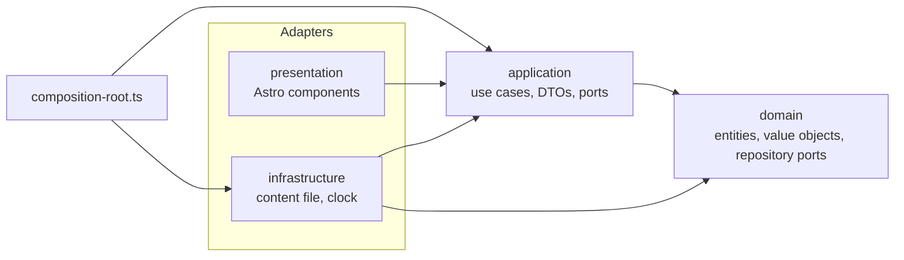

# Tomas Ariza Rodriguez · Portfolio

Personal portfolio of a software engineer and mobile developer based in Bogotá, Colombia.

**Live site:** https://tomas-ariza-portfolio.YOUR-SUBDOMAIN.workers.dev

The site is small on purpose, but it is built like a production codebase: Clean Architecture with
enforced layer boundaries, unit tests with coverage thresholds, CI on every pull request, and strict
security headers.

## Stack

| Concern   | Choice                                                        |
| --------- | ------------------------------------------------------------- |
| Framework | [Astro](https://astro.build) 7, static output, zero client JS |
| Language  | TypeScript (strictest configuration)                          |
| Tests     | Vitest with V8 coverage                                       |
| Quality   | ESLint (typescript-eslint, eslint-plugin-astro), Prettier     |
| CI        | GitHub Actions, Dependabot                                    |
| Hosting   | Cloudflare Workers static assets (free tier)                  |

## Architecture



Dependencies only point inward. The rule is enforced by `no-restricted-imports` in
[`eslint.config.js`](eslint.config.js), so a violation fails CI.

```
src/
├── domain/            Entities, value objects and repository interfaces. No framework code.
├── application/       Use cases, output DTOs and the Clock port.
├── infrastructure/    Adapters: the content file, its repository and the system clock.
├── presentation/      Astro layout, components, formatters and view models.
├── pages/             Routes: call use cases and render components.
└── composition-root.ts  The only place where concrete classes are wired together.
```

More detail in [`docs/architecture.md`](docs/architecture.md) and the decision records in
[`docs/adr`](docs/adr).

## Getting started

Requires Node.js 22.12 or later (Node 24 LTS recommended, see `.nvmrc`).

```bash
npm install
npm run dev        # http://localhost:4321
```

All content lives in [`src/infrastructure/data/portfolio.data.ts`](src/infrastructure/data/portfolio.data.ts).

## Scripts

| Script                  | What it does                                       |
| ----------------------- | -------------------------------------------------- |
| `npm run dev`           | Local development server                           |
| `npm run build`         | Production build into `dist/`                      |
| `npm run preview`       | Serve the production build locally                 |
| `npm run lint`          | ESLint, including architecture boundary rules      |
| `npm run format`        | Format the code with Prettier                      |
| `npm run check`         | Type-check TypeScript and Astro files              |
| `npm run test`          | Unit tests                                         |
| `npm run test:coverage` | Unit tests with coverage thresholds                |
| `npm run verify:dist`   | Checks the build output is compatible with the CSP |
| `npm run verify`        | Everything above, in the same order as CI          |

## Deployment

Cloudflare Workers Builds is connected to this repository. Every push to `main` builds the site
(`npm run build`) and deploys it (`npx wrangler deploy`) using [`wrangler.jsonc`](wrangler.jsonc).
Pull requests get preview versions.

## Security

See [`SECURITY.md`](SECURITY.md).

## License

Source code under the [MIT License](LICENSE). Personal content is not licensed for reuse.
